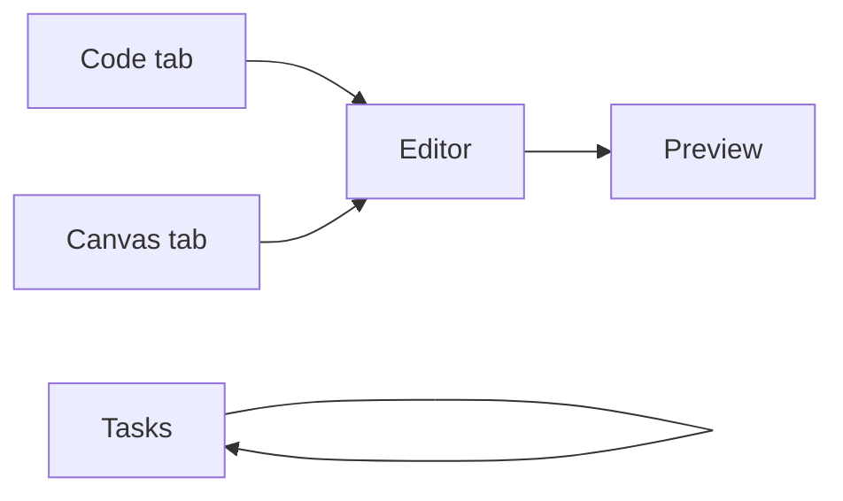

# Hello from ARCHstudio 👋

This file was created by the agent to demo the **Editor** and **Preview** tabs.

## What's new

- **Code + Canvas → Editor**: One tab for editing files and artifacts
- **Save back to disk**: Edit markdown/JSON and hit Save — it writes via the new `writeFile` IPC
- **Preview with real rendering**: Markdown renders with syntax highlighting, tables, and mermaid

## Code block test

```typescript
function greet(name: string): string {
  return `Hello, ${name}!`
}
console.log(greet('Skobez'))
```

## Table test

| Tab | Before | After |
|-----|--------|-------|
| 1 | Code | Editor |
| 2 | Canvas | Editor |
| 3 | Preview | Preview (fixed) |
| 4 | Tasks | Tasks (unchanged) |

## Mermaid test



> That's it — open this file in the Editor tab, then switch to Preview to see it rendered.